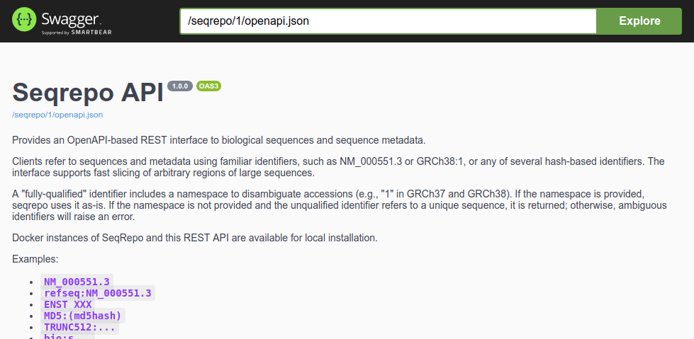

# seqrepo-rest-api

Provides an OpenAPI-based REST interface to biological sequences and
sequence metadata.

Clients refer to sequences and metadata using familiar identifiers,
such as NM_000551.3 or GRCh38:1, or any of several hash-based
identifiers.  The interface supports fast slicing of arbitrary regions
of large sequences.

A "fully-qualified" identifier includes a namespace to disambiguate
accessions (e.g., "1" in GRCh37 and GRCh38). If the namespace is
provided, seqrepo uses it as-is.  If the namespace is not provided and
the unqualified identifier refers to a unique sequence, it is
returned; otherwise, ambiguous identifiers will raise an error.

SeqRepo favors identifiers from [identifiers.org](identifiers.org)
whenever available.  Examples include
[refseq](https://registry.identifiers.org/registry/refseq) and
[ensembl](https://registry.identifiers.org/registry/ensembl).

This repository is the REST interface only.  The underlying data is
provided by
[seqrepo](https://github.com/biocommons/biocommons.seqrepo/).

This repository also implements the [GA4GH refget (v1)
protocol](https://samtools.github.io/hts-specs/refget.html) at
`<baseurl>/refget/`.

Released under the Apache License, 2.0.

Links:
[Issues](https://github.com/biocommons/seqrepo-rest-service/issues) |
[Docker
image](https://cloud.docker.com/u/biocommons/repository/docker/biocommons/seqrepo-rest-service)

## Citation

Hart RK, Prlić A (2020)  
**SeqRepo: A system for managing local collections of biological sequences.**  
PLoS ONE 15(12): e0239883. https://doi.org/10.1371/journal.pone.0239883

## Examples

### OpenAPI docs

The REST interface is implemented with OpenAPI. Current and
interactive documentation is available at the base url for the
endpoint.

### Fetch Sequence

Fetch sequence by an accession:

    $ curl -f http://0.0.0.0:5000/seqrepo/1/sequence/NP_001274413.1
    MERSFVWLSCLDSDSCNLTFRLGEVESHACSPSLLWNLLTQYLPPGAGHILRTYNFPVLSCVSSCHLIGGKMPEN

Or not:

    $ curl -f http://0.0.0.0:5000/seqrepo/1/sequence/bogus
    curl: (22) The requested URL returned error: 404 NOT FOUND

Popular digests are also available:

    $ curl -f http://0.0.0.0:5000/seqrepo/1/sequence/MD5:d52770ec477d0c9ee01fa034aff62cb4
    MERSFVWLSCLDSDSCNLTFRLGEVESHACSPSLLWNLLTQYLPPGAGHILRTYNFPVLSCVSSCHLIGGKMPEN

With range:

    # 👉 Seqrepo uses interbase coordinates.
    $ curl -f "http://0.0.0.0:5000/seqrepo/1/sequence/NP_001274413.1?start=5&end=10"
    VWLSC

### Fetch Metadata

    $ curl -f "http://0.0.0.0:5000/seqrepo/1/metadata/GRCh38:1"
    {
      "added": "2016-08-27T21:17:00Z",
      "aliases": [
        "GRCh38:1",
        "GRCh38:chr1",
        "GRCh38.p1:1",
        "GRCh38.p1:chr1",
		⋮
        "GRCh38.p9:chr1",
        "MD5:6aef897c3d6ff0c78aff06ac189178dd",
        "refseq:NC_000001.11",
        "SEGUID:FCUd6VJ6uikS/VWLbhGdVmj2rOA",
        "SHA1:14251de9527aba2912fd558b6e119d5668f6ace0",
        "sha512t24u:Ya6Rs7DHhDeg7YaOSg1EoNi3U_nQ9SvO",
        "ga4gh:SQ.Ya6Rs7DHhDeg7YaOSg1EoNi3U_nQ9SvO"
      ],
      "alphabet": "ACGMNRT",
      "length": 248956422
    }

## Development

    $ make devready
    $ source venv/3.8/bin/activate

## Running a local instance

Once installed as above, you should be able to:

    $ SEQREPO_DIR=/usr/local/share/seqrepo/latest seqrepo-rest-service

The navigate to the URL shown in the console output.

## Running a docker image

A docker image is available.  It expects to have a local
[seqrepo](https://github.com/biocommons/biocommons.seqrepo/) instance
installed.  Invoke like this:

    $ docker run \
      --name seqrepo-rest-service \
      --detach --rm -p 5000:5000 \
      -v /usr/local/share/seqrepo/:/usr/local/share/seqrepo/ \
      biocommons/seqrepo-rest-service

.